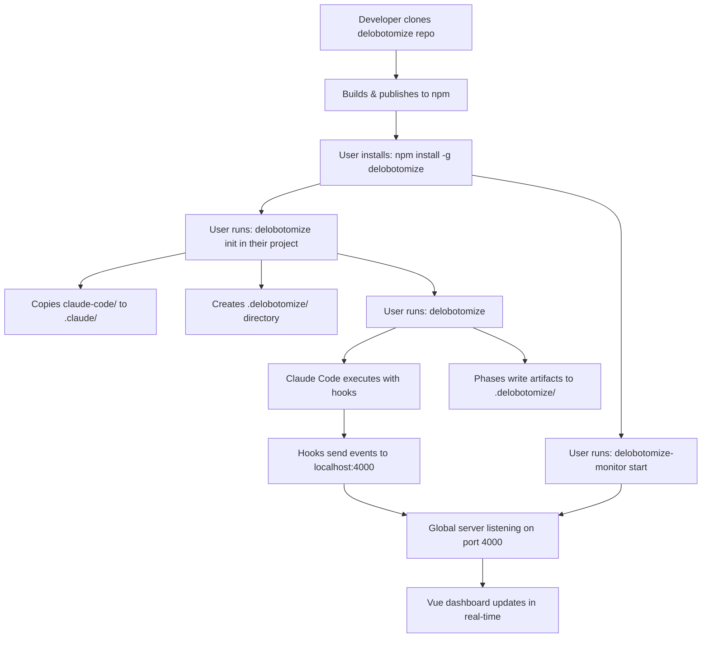

# Delobotomize Product Requirements Document v15.0  
## The Complete, Unified, Enhanced Edition

**Status**: Ultimate Authoritative Specification  
**Version**: 15.0  
**Date**: 2025-11-16  
**Baseline**: v14.0 (scope) + v11.x enhancements (descriptions)  
**Maintainer**: Delobotomize Core Team  
**License**: MIT (with full vendor attribution)  

---

## VERSION HISTORY

- **v15.0** (2025-11-16): Consolidated edition - v14 scope + enhanced descriptions from v11.x
- **v14.0** (2025-11-18): Three-system architecture, complete vendoring strategy, frozen black boxes
- **v13ISH** (2025-11-17): Vendor integration details, unified monorepo emphasis
- **v11.2-2** (2025-11-16): Googleplex+1 edition, single-repo clarification
- **v11.0.1a** (2025-11-16): Single repository edition, corrected two-repo confusion
- **v11.2** (2025-11-16): Comprehensive two-repo model (superseded)
- **v11.0** (2025-11-16): Original comprehensive edition

**Consolidation Methodology**: Systematic section-by-section analysis using v14 as baseline, enhanced with best descriptions from v11+ versions. All decisions validated against user intent. No scope creep - only clarity improvements.

---

## TABLE OF CONTENTS

1. Executive Summary & Architectural Mandate
2. Repository Structure
3. Vendored Systems - Frozen Black Boxes
4. Remote Asset - Claude Code CLI
5. Hook Bridge Architecture
6. Unified Configuration System
7. CLI Command Specification
8. Five-Phase Recovery Pipeline
9. Monitoring System (Vendored, Zero Development)
10. Legal Attribution & Compliance
11. Development Focus Manifesto
12. Implementation Checklist
13. Success Metrics
14. Risk Mitigation
15. Non-Goals
16. Future Roadmap
17. Glossary
18. Final Declaration & Conflicts

---

## SECTION 1: EXECUTIVE SUMMARY & ARCHITECTURAL MANDATE

### 1.1 Product Definition

Delobotomize is a **Claude Code recovery pipeline** that rescues context-collapsed AI coding sessions through systematic 5-phase execution. It monitors Claude Code sessions via a vendored proxy, analyzes failures through natural language agents, and applies reversible fixes with human approval.

**Core Innovation**: A single global monitoring server tracks unlimited target projects, providing real-time observability while maintaining project-local execution and artifacts.

### 1.2 The Three-System Architecture

The repository **vendors two complete MIT-licensed systems** and integrates with a **third remote proprietary system**:

1. **Delobotomize Core** (active development): CLI orchestration, 5-phase pipeline, artifact management, integrity checking  
2. **Multi-Agent Workflow** (vendored, frozen): Monitoring server, Vue dashboard, Python hooks, event storage  
3. **Claude Code Proxy** (vendored, frozen): Multi-provider API proxy, token tracking, rate limiting, file logging  
4. **Claude Code CLI** (remote asset): Proprietary AI assistant (not vendored, user-installed)

**Critical Boundary**: Only Delobotomize Core is actively developed. Vendored systems are **black boxes** used via their stable APIs.

### 1.3 What Makes It Different

**Architecture**:
- **Single repository, three codebases**: Complete vendoring of MIT-licensed dependencies
- **Source vs Runtime**: Tool repository contains templates; target projects receive generated artifacts
- **Frozen black boxes**: Vendored systems never modified, only integrated via stable contracts

**Monitoring**:
- **Session-level observation**: Non-invasive monitoring via proxy logs and hooks
- **Multi-project support**: One global server tracks unlimited concurrent projects
- **Real-time telemetry**: WebSocket broadcasting to Vue and optional Svelte dashboards

**Recovery**:
- **5-phase systematic pipeline**: Audit → Analysis → Recovery → Fix → Iterate
- **Natural language configuration**: Markdown agents and skills, not YAML schemas
- **Reversible fixes**: Atomic commits with explicit rollback procedures
- **Human-in-the-loop**: Zero auto-approval, every change requires user confirmation

**Development Focus**:
- **90% CLI effort**: Core value is 5-phase pipeline, not GUI or proxy
- **10% integration**: Hook bridge is sole connection point between systems
- **Production-ready**: Complete, tested, documented system (not prototype)

### 1.4 Key Capabilities

1. **Monitor**: Detect stalls, rate limits, context saturation via proxy logs and hooks
2. **Audit**: Systematically analyze project structure and session logs for issues
3. **Analyze**: Build causal chains, assign confidence scores, prioritize fixes
4. **Recover**: Generate step-by-step recovery plans with rollback procedures
5. **Fix**: Apply changes atomically with safety checks and user approval
6. **Iterate**: Extract patterns to prevent future failures

---

## SECTION 2: REPOSITORY STRUCTURE

### 2.1 Root Structure (What You Build)

**This is the repository you**:
- Clone with `git clone`
- Edit and develop
- Publish with `npm publish`
- Install with `npm install -g delobotomize`

```
delobotomize/                          # ROOT REPOSITORY
├── LICENSE                            # MIT license for Delobotomize
├── NOTICE                             # Legal attribution for vendored code
├── CLAUDE.md                          # Development guide for Delobotomize Core
├── CONVENTIONS.md                     # Cross-system pattern reference
│
├── src/                               # ACTIVE DEVELOPMENT (Bun/TypeScript)
│   ├── cli.ts                         # Commander-based CLI entry point
│   ├── init.ts                        # Project initialization logic
│   ├── phases/                        # 5-phase pipeline implementations
│   │   ├── audit.ts
│   │   ├── analysis.ts
│   │   ├── recovery.ts
│   │   ├── fix.ts
│   │   └── iterate.ts
│   ├── bridge/                        # Hook bridge (proxy → monitoring)
│   │   ├── log-reader.ts              # Reads proxy.log line-by-line
│   │   ├── parser.ts                  # Validates TSV format
│   │   ├── transformer.ts             # Maps to monitoring event schema
│   │   └── relayer.ts                 # POSTs to monitoring server
│   ├── config.ts                      # Unified configuration management
│   ├── integrity.ts                   # Checks .claude/ against source
│   └── artifacts.ts                   # Artifact generation and validation
│
├── integrations/                      # VENDORED SYSTEMS (frozen)
│   ├── multi-agent-workflow/          # Full copy (commit 4f2a9c1)
│   │   ├── LICENSE                    # Preserved MIT license
│   │   ├── apps/
│   │   │   ├── server/                # Bun monitoring server (port 4000)
│   │   │   └── client/                # Vue 3 dashboard (port 5173)
│   │   ├── hooks/
│   │   │   └── python/                # 8 Python hook scripts
│   │   └── tests/                     # Original test suite (run in CI)
│   │
│   ├── claude-code-proxy/             # Full copy (commit b8d3e2f)
│   │   ├── LICENSE                    # Preserved MIT license
│   │   ├── src/
│   │   │   ├── main.py                # FastAPI server (port 8082)
│   │   │   ├── middleware/
│   │   │   │   └── file_logger.py     # Patched logging middleware
│   │   │   └── providers/             # All API providers (5 total)
│   │   └── tests/                     # Original test suite (run in CI)
│   │
│   └── dashboard-svelte/              # OPTIONAL (active development)
│       └── src/                       # SvelteKit primary UI (port 5174)
│
├── claude-code/                       # TEMPLATE FILES (natural language)
│   ├── CLAUDE.base.md                 # Orchestrator template
│   ├── settings.json.template         # Configuration template
│   ├── agents/                        # 15+ agent definitions (YAML + markdown)
│   ├── skills/                        # 5 phase-specific skill libraries
│   ├── hooks/                         # Hook templates (copied from vendor)
│   └── commands/                      # Slash command definitions
│
└── scripts/                           # BUILD & DEPLOYMENT
    ├── postinstall.js                 # Copies templates, applies proxy patch
    ├── validate-vendor.js             # Checks vendored code integrity
    └── validate-legal.js              # Ensures license compliance
```


### 2.2 Runtime Artifacts (What Gets Created)

**These are NOT separate repositories.** They are what the tool creates when executed in target directories.

When you run `delobotomize init` in **any directory**, it creates:

```
target-project/                        # ← Any directory you target
├── .claude/                           # Copied from delobotomize/claude-code/
│   ├── settings.json                  # Generated from template
│   ├── CLAUDE.md                      # Generated orchestration constitution
│   ├── agents/                        # Copied (15+ files)
│   ├── skills/                        # Copied (5 phase directories)
│   ├── hooks/                         # Copied from integrations/multi-agent-workflow/
│   └── commands/                      # Copied slash commands
│
└── .delobotomize/                     # Created during execution
    ├── cache/                         # 30-minute TTL scan cache
    ├── proxy.log                      # Live API traffic log (from proxy)
    ├── delobotomize.db                # SQLite database
    ├── monitor.port                   # Active monitoring port (auto-discovered)
    ├── runs/                          # Per-execution artifacts
    │   └── {runId}/
    │       ├── manifest.json
    │       ├── audit/
    │       │   ├── audit-report.md
    │       │   ├── file-inventory.json
    │       │   └── session-incidents.json
    │       ├── analysis/
    │       │   ├── ANALYSIS.md        # Human-readable report
    │       │   ├── WORKFILE.json      # Machine-readable issues
    │       │   └── DIFFS.txt          # Proposed patches
    │       ├── recovery/
    │       │   ├── recovery-plan.md
    │       │   └── execution-order.json
    │       ├── fix/
    │       │   ├── fix-report.md
    │       │   ├── approval-log.json
    │       │   ├── changes.patch
    │       │   ├── commits.json
    │       │   └── test-results.json
    │       └── iterate/
    │           └── iterate-notes.md
    └── claude-docs-integrity.json     # Checksum manifest
```

### 2.3 Source vs Runtime Distinction

**Key Insight**: One repository, two structures.

| Aspect | Source (delobotomize/) | Runtime (target-project/) |
|--------|------------------------|---------------------------|
| **Location** | Your development machine | Any project directory |
| **Version Control** | Git repository | Generated files (not committed) |
| **Purpose** | Tool development | Tool execution |
| **Modification** | Edit source code | Generated/managed by tool |
| **Distribution** | npm package | Created by `delobotomize init` |

**Workflow**:
1. Developer edits `delobotomize/` (source)
2. Publishes to npm
3. User installs globally
4. User runs `delobotomize init` in their project
5. Tool copies templates to `.claude/`
6. Tool creates `.delobotomize/` during execution

### 2.4 Installation & Execution Flow



**ONE TIME (Global)**:
```bash
# Install the tool
npm install -g delobotomize

# Start monitoring server (optional, for observability)
delobotomize-monitor start
# Server: http://localhost:4000
# Dashboard: http://localhost:5173
```

**PER PROJECT (Local)**:
```bash
cd ~/my-project                    # Any project directory
delobotomize init                  # Creates .claude/ and .delobotomize/
delobotomize                       # Runs the 5-phase pipeline
```

---

## SECTION 3: VENDORED SYSTEMS - FROZEN BLACK BOXES

### 3.1 Multi-Agent Workflow (Vendored)

**Source**: `https://github.com/apolopena/multi-agent-workflow` (MIT)  
**Commit**: `4f2a9c1` (2025-11-10)  
**Location**: `integrations/multi-agent-workflow/` (complete, unmodified)  

**Capabilities Preserved**:  
- **8 Python Hook Types**: session_start, pre_tool_use, post_tool_use, subagent_stop, user_prompt_submit, notification, stop, session_end  
- **Bun Monitoring Server**: HTTP + WebSocket on port 4000, SQLite storage  
- **Vue 3 Dashboard**: Real-time event timeline, pulse charts, session management (port 5173)  
- **Event Batching**: Buffers events in memory, flushes every 100ms  
- **Retry Logic**: 3 attempts with exponential backoff for failed POSTs  
- **Multi-Project**: Supports unlimited concurrent projects  

**Integration Contract**:  
- **Input**: JSON POST to `http://localhost:4000/api/events`  
- **Output**: WebSocket messages to subscribed clients, SQLite storage  
- **Configuration**: Environment variables derived from `.claude/settings.json`  
- **Lifecycle**: Started/stopped by Delobotomize CLI, never modified  

**Development Status**: **FROZEN**. No code changes. Bugs reported upstream. Original test suite run in CI.

### 3.2 Claude Code Proxy (Vendored)

**Source**: `https://github.com/aaronmiller/claude-code-proxy` (MIT)  
**Commit**: `b8d3e2f` (2025-11-08)  
**Location**: `integrations/claude-code-proxy/` (complete, unmodified except patch)  

**Capabilities Preserved**:  
- **5 API Providers**: Anthropic (direct), OpenRouter, OpenAI, Ollama, LMStudio  
- **Model Tier Routing**: big (Opus-class), middle (Sonnet-class), small (Haiku-class)  
- **Token Tracking**: Prompt, completion, reasoning tokens  
- **Cost Calculation**: Per-provider pricing, cumulative totals  
- **Rate Limiting**: Middleware with configurable requests per minute  
- **Health Checks**: `/healthz` endpoint for uptime monitoring  
- **Retry Logic**: Automatic retry on 429/503 with exponential backoff  

**Modification Applied**: **Single file patch only**  
- **File**: `src/middleware/file_logger.py` (added, not modified)  
- **Purpose**: Writes TSV log to `.delobotomize/proxy.log` on every API call  
- **Application**: Via `scripts/apply-proxy-patch.js` on `npm install`  
- **Risk**: Zero change to existing proxy logic (pure additive middleware)  

**Integration Contract**:  
- **Input**: API requests on port 8082, forwarded to upstream providers  
- **Output**: TSV log at `.delobotomize/proxy.log` (format defined below)  
- **Configuration**: `.delobotomize/proxy.env` with provider keys and routing  
- **Lifecycle**: Started/stopped by Delobotomize CLI  

**Development Status**: **FROZEN**. No code changes except logging patch.

---

## SECTION 4: REMOTE ASSET - CLAUDE CODE CLI

### 4.1 Proprietary Remote Dependency

**Asset**: Claude Code CLI by Anthropic PBC  
**License**: Proprietary (not vendorable)  
**Distribution**: Installed via npm (`npm install -g @anthropic-ai/claude-code`)  
**Version**: Auto-updating (no version pinning required)  

**Integration Points**:  
- **Configuration**: Reads `.claude/settings.json` on startup  
- **Hooks**: Executes Python scripts in `.claude/hooks/` on events  
- **Proxy**: Respects `ANTHROPIC_API_BASE_URL` environment variable  
- **API Contract**: Stable CLI interface, backward compatible  

**Validation**: `delobotomize init` checks for Claude Code installation:  
- If missing: Prints installation command and exits with code 1  
- If present: Continues initialization  

**Legal**: No redistribution. Users must accept Anthropic's terms separately.

---

## SECTION 5: HOOK BRIDGE ARCHITECTURE

### 5.1 Bridge Purpose and Scope

The **Hook Bridge** is the **sole active integration code** connecting Proxy → Monitoring → GUI. It performs **stateless translation only**.

**Bridge Components** (must be implemented in `src/bridge/`):  
1. **Log Reader**: Watches `.delobotomize/proxy.log` for new lines using file system notifications  
2. **Parser**: Validates TSV format against defined schema  
3. **Transformer**: Maps proxy fields to monitoring event schema  
4. **Relayer**: POSTs transformed events to monitoring server  

**Bridge Contract**:  
- **Input**: TSV lines from `proxy.log`  
- **Output**: Valid JSON payloads to `http://localhost:4000/api/events`  
- **State**: None (each line processed independently)  
- **Error Handling**: Log to stderr, continue processing (never block)  
- **Performance**: Process 1000+ lines per second without buffering  

### 5.2 Proxy Log Format (Contract)

**Location**: `.delobotomize/proxy.log`  
**Format**: Tab-Separated Values (TSV), one line per API call  
**Fields**: `timestamp | session_id | method | status | prompt_tokens | completion_tokens | reasoning_tokens | latency_ms | model | cost`

**Example**:  
```
2025-11-18T05:00:00.123Z | abc-123-def-456 | POST /v1/messages | 200 | 1850 | 450 | 2100 | 2341 | anthropic/claude-sonnet-4 | 0.0234
```

**Validation**:  
- Timestamp must be ISO 8601 with milliseconds and Z suffix  
- session_id must be UUID format  
- status must be integer HTTP status code  
- All token fields must be non-negative integers  
- cost must be non-negative number with 4 decimal places  

**Responsibility**: Vendored proxy guarantees this format. Bridge **assumes format is correct** (no defensive parsing beyond schema validation).

### 5.3 Monitoring Event Schema (Contract)

**Destination**: `POST http://localhost:4000/api/events`  
**Format**: JSON with required fields  

**Required Fields**:  
- `id`: UUID generated by bridge  
- `type`: EventType enum (tool_use, stall_detected, rate_limit, context_saturation, reasoning_overflow, auth_failure, model_refusal)  
- `timestamp`: ISO 8601 Date  
- `session_id`: UUID from proxy log  
- `project_id`: String from environment (current working directory name)  
- `context`: Object with event-specific data  

**Event Type Determination Logic**:  
- **tool_use**: Every successful API call (status 200)  
- **stall_detected**: No log entries for `stall_thresholds.{phase}` seconds  
- **rate_limit**: Status 429  
- **context_saturation**: `(prompt_tokens + reasoning_tokens) / context_window > 0.85`  
- **reasoning_overflow**: `reasoning_tokens > reasoning.budget * 0.8`  
- **auth_failure**: Status 403  
- **model_refusal**: Status 400 with specific error code  

**Responsibility**: Bridge must transform every proxy log line into **exactly one** monitoring event. Vendored monitoring server validates event format and stores in SQLite.

---

## SECTION 6: UNIFIED CONFIGURATION SYSTEM

### 6.1 Single Source of Truth

**File**: `.claude/settings.json`  
**Purpose**: Controls **all three systems** (Delobotomize, Monitoring Server, Proxy)  

**Schema**:  
```typescript
interface UnifiedSettings {
  delobotomize: {
    phases: string[];                    // ["audit", "analysis", "recovery", "fix", "iterate"]
    integrity_check: boolean;            // true (enforced)
    artifact_ttl_minutes: number;        // 1440 (24 hours)
  };
  
  multi_agent_workflow: {
    hooks: {
      enabled: boolean;                 // true
      server_url: string;               // "http://localhost:4000"
      timeout_ms: number;               // 5000
      scripts: Record<string, string>;  // Maps event type to Python script path
    };
    dashboard: {
      enabled: boolean;                 // true
      port: number;                     // 5173 (Vue), 5174 (Svelte)
      auto_start: boolean;              // false (manual start)
    };
  };
  
  claude_code_proxy: {
    port: number;                       // 8082
    providers: Record<string, ProviderConfig>;
    model_routing: {
      big: string;                      // "anthropic/claude-opus-4"
      middle: string;                   // "openrouter/openai/gpt-5-preview"
      small: string;                    // "ollama/phi-4"
    };
    file_logging: {
      enabled: boolean;                 // true
      path: string;                     // ".delobotomize/proxy.log"
    };
    reasoning: {
      enabled: boolean;                 // true
      budget: number;                   // 10000 (tokens per session)
    };
  };
}
```

### 6.2 Configuration Generation

**During `delobotomize init`**:  
- Reads `delobotomize/claude-code/settings.json.template`  
- Injects project-specific values (PROJECT_NAME, PROJECT_ROOT, DELOBOTOMIZE_VERSION)  
- Generates `.claude/settings.json` with all three system sections  
- Writes `.delobotomize/proxy.env` with proxy-specific environment variables  

**During `delobotomize stack start`**:  
- Loads `.claude/settings.json`  
- Extracts `multi_agent_workflow` section, passes as env vars to monitoring server  
- Extracts `claude_code_proxy` section, passes as env vars to proxy  
- Extracts `delobotomize` section, uses for CLI behavior  

---

## SECTION 7: CLI COMMAND SPECIFICATION

### 7.1 Command Reference

```bash
# CORE PIPELINE
delobotomize run                    # Execute full 5-phase pipeline
delobotomize -audit                 # Execute audit phase only
delobotomize -analysis              # Execute analysis phase only
delobotomize -recovery              # Execute recovery phase only
delobotomize -fix                   # Execute fix phase only (requires approval)
delobotomize -iterate               # Execute iterate phase only

# STACK MANAGEMENT
delobotomize stack start            # Start: proxy + monitoring + bridge + dashboards
delobotomize stack stop             # Stop all components gracefully
delobotomize stack status           # Show running processes and ports

# COMPONENT CONTROL
delobotomize proxy start            # Start proxy with logging
delobotomize proxy stop             # Stop proxy
delobotomize monitoring start       # Start monitoring server + bridge
delobotomize monitoring stop        # Stop monitoring server
delobotomize bridge start           # Start hook bridge (usually auto)

# DASHBOARD CONTROL
delobotomize dashboard vue          # Start Vue dashboard (port 5173)
delobotomize dashboard svelte       # Start Svelte dashboard (port 5174)
delobotomize dashboard both         # Start both dashboards

# PROJECT MANAGEMENT
delobotomize init [--full]          # Initialize .claude/ and .delobotomize/
delobotomize status                 # Show current status
delobotomize list-runs              # List historical runs
delobotomize rollback --run-id <id> # Revert to checkpoint
delobotomize clean                  # Remove old runs (keep last 10)
```

### 7.2 Phase Command Contracts

**`delobotomize -audit`**:  
- **Precondition**: `.claude/` exists and passes integrity check  
- **Input**: `.delobotomize/proxy.log` (via bridge), project file system  
- **Output**: `audit-report.md`, `file-inventory.json`, `session-incidents.json`  
- **Failure**: Exits with code 1 if integrity check fails  
- **Duration**: <10 minutes for 10K files  

**`delobotomize -analysis`**:  
- **Precondition**: Audit artifacts exist  
- **Input**: Audit artifacts  
- **Output**: `ANALYSIS.md`, `WORKFILE.json`, `DIFFS.txt`  
- **Failure**: Exits with code 1 if causal chain has circular dependencies  
- **Duration**: <5 minutes  

**`delobotomize -recovery`**:  
- **Precondition**: Analysis artifacts exist  
- **Input**: `WORKFILE.json`, `ANALYSIS.md`  
- **Output**: `recovery-plan.md`, `execution-order.json`  
- **Failure**: Exits with code 1 if any fix lacks rollback procedure  
- **Duration**: <3 minutes  

**`delobotomize -fix`**:  
- **Precondition**: Recovery artifacts exist, git repository is clean  
- **Input**: Recovery plan, user approvals  
- **Output**: `fix-report.md`, `approval-log.json`, `changes.patch`, `commits.json`, `test-results.json`  
- **Failure**: Rolls back to checkpoint on any test failure or user rejection  
- **Duration**: 1 minute per fix (excluding user approval time)  

**`delobotomize -iterate`**:  
- **Precondition**: All previous phases complete  
- **Input**: All phase artifacts  
- **Output**: `iterate-notes.md`  
- **Failure**: Cannot fail (no-op if no observations)  
- **Duration**: <2 minutes  

---

